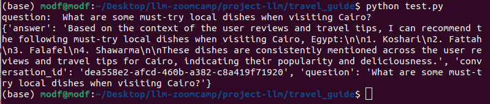
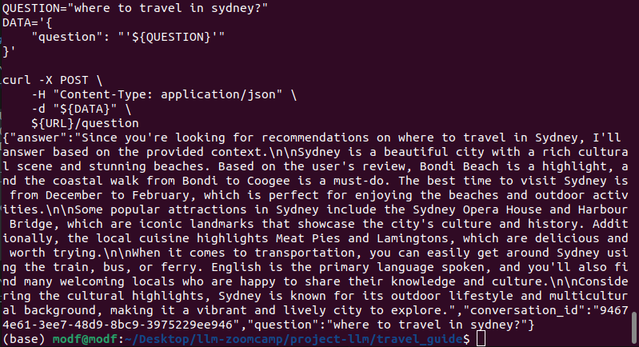
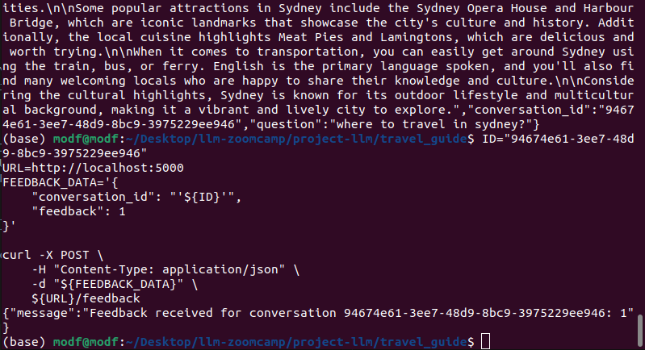
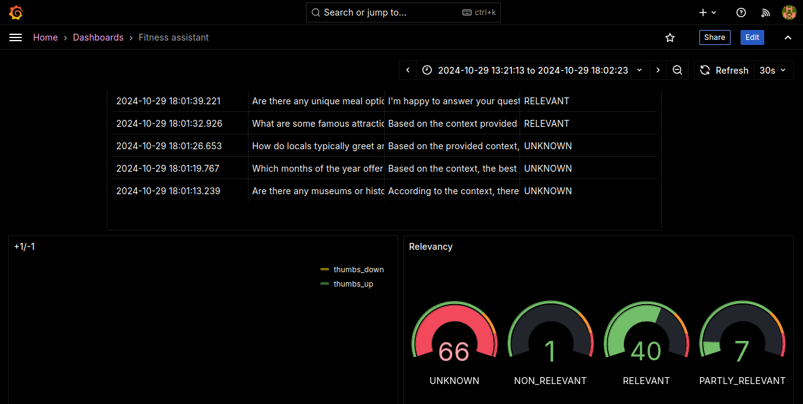

# THE TOUR GUIDE


A travel guide app helps people plan their trips by giving them useful tips and information. It includes reviews and ratings from other travelers, along with details about local attractions and food. This makes it easier for users to choose where to go and what to do for a great travel experience.

## Project Overview

## Use Case

The Travel Guide RAG Application helps users plan trips with personalized recommendations based on their interests. Key features include:

- **Search for Destinations**: Find detailed information on travel locations.
- **Read Reviews and Ratings**: Access real experiences from other travelers.
- **Discover Local Highlights**: Explore cultural attractions and local cuisines.
- **Receive Travel Tips**: Get insights on transportation, safety, and best visiting times.
- **Plan Itineraries**: Create personalized travel plans for memorable trips.

This app empowers users to make informed decisions, enhancing their overall travel experience.


# Dataset Column Summaries

- **destination**: The name of the travel location being reviewed.
- **user_review**: Personal experiences and opinions shared by travelers about the destination.
- **travel_tip**: Practical advice and recommendations for future visitors.
- **rating**: A numerical score representing the overall quality of the destination based on user feedback.
- **best_time_to_visit**: The optimal season or time frame for visiting the destination.
- **local_cuisine_highlights**: Notable dishes or food experiences unique to the destination.
- **location_coordinates**: Geographic coordinates indicating the precise location of the destination.
- **popular_attractions**: Key sites or activities that draw visitors to the destination.
- **transportation_options**: Available methods of travel to and within the destination.
- **language_spoken**: The primary language(s) used by locals in the destination.
- **safety_rating**: An assessment of how safe the destination is for travelers.
- **activities_available**: A list of recreational or cultural activities that can be enjoyed at the destination.
- **cultural_highlights**: Significant cultural features or experiences that define the destination.

You can find the data in `/data/travel_data.csv`.

## Technologies

- **Python 3.12**
- **Docker and Docker Compose** for containerization
- **Minsearch** for full-text search
- **Flask** as the API interface
- **Grafana** for monitoring and **PostgreSQL** as the backend
- **GROQ** as an LLM

## Environment Preparation

We use the GROQ API, and you need to provide the API key:

1. Install **direnv**. If you use Ubuntu, run:
   ```bash
   sudo apt install direnv
   direnv hook bash >> ~/.bashrc
   ```
2. Copy `.envrc_template` into `.envrc` and insert your key there.
3. use a separate API key for GROQ
4. Run `direnv allow` to load the key into your environment.

For dependency management, we use pipenv, so you need to install it:

`pip install pipenv`

Once installed, you can install the app dependencies:

`pipenv install --dev`

## How to run the application

### Database configuration

Before the application starts for the first time, the database needs to be initialized.

First, run postgres container using docker compose:

`docker-compose up postgres`

Then run the `db_prep.py` script which will set it up and for that you need to run the following commands:
```bash
pipenv shell

cd travel_guide

export POSTGRES_HOST=localhost
python db_prep.py
```
### Running with Docker-Compose

The easiest way to run the application is with docker-compose:

`docker-compose up`

### Running with Docker (without compose)

Sometimes you might want to run the application in Docker without Docker Compose, e.g., for debugging purposes.

First, prepare the environment by running Docker Compose as in the previous section.

Next, build the image:

`docker build -t fitness-assistant .`

And run it:
```bash
docker run -it --rm \
    --env-file=".env" \
    -e GROQ_API_KEY=${GROQ_API_KEY} \
    -e DATA_PATH="data/travel_data.csv" \
    -p 5000:5000 \
    fitness-assistant
```

### Using the application

When the application is running using docker compose as mentioned earlier, we can start using it.

#### Using requests

When the application is running, you can use requests to send questions—use `test.py` for testing it:

`pipenv run python test.py`

It will pick a random question from the ground truth dataset and send it to the app.

The output will look something like this-



### Using CURL

You can also use curl for interacting with the API:

```bash
URL=http://localhost:5000
QUESTION="where to travel in sydney?"
DATA='{
    "question": "'${QUESTION}'"
}'

curl -X POST \
    -H "Content-Type: application/json" \
    -d "${DATA}" \
    ${URL}/question
```

You will see something like the following in the response:




Sending feedback:
```bash
ID="94674e61-3ee7-48d9-8bc9-3975229ee946"
URL=http://localhost:5000
FEEDBACK_DATA='{
    "conversation_id": "'${ID}'",
    "feedback": 1
}'
              
curl -X POST \
    -H "Content-Type: application/json" \
    -d "${FEEDBACK_DATA}" \
    ${URL}/feedback
```



### App Code

The code for the application is in travel_guide folder:

## Application Files

- **app.py**: The Flask API, the main entry point to the application.
- **rag.py**: The main RAG logic for retrieving data and building the prompt.
- **ingest.py**: Loads the data into the knowledge base.
- **minsearch.py**: An in-memory search engine.
- **db.py**: Logic for logging requests and responses to PostgreSQL.
- **db_prep.py**: Script for initializing the database.
- **test.py**: Selects a random question for testing.


### Interface
We use Flask for serving the application as an API.

### Ingestion

The ingestion script is in `ingest.py`.

Since we use an in-memory database, minsearch, as our knowledge base, we run the ingestion script at the startup of the application.

It's executed inside `rag.py` when we import it.

## Experiments

For experiments, we use Jupyter notebooks. They are in the notebooks folder.

To start Jupyter, run:
```bash
cd notebooks
pipenv run jupyter notebook
```

We have the following notebooks:

    eval_vector_rag.ipynb
    elasticsearch_rag.ipynb 
    evealuation_data.ipynb
    prepare_nb.ipynb

### Retrieval evaluation

The basic approach - using minsearch without any boosting - gave the following metrics:

    Hit rate: 77.30%
    MRR: 53.28%

The improved version (with tuned boosting):

    Hit rate: 85%
    MRR: 58%

The best boosting parameters:
```bash
boost = {'destination': 2.485673359952678,
  'user_review': 2.9196237991381584,
  'travel_tip': 1.9014614654735604,
  'best_time_to_visit': 0.2946106215502525,
  'local_cuisine_highlights': 1.6224280634698078,
  'location_coordinates': 0.7452008126129724,
  'popular_attractions': 2.5540130530716985,
  'transportation_options': 1.4757377423401572,
  'language_spoken': 0.05435765500930245,
  'activities_available': 1.210048239340701,
  'cultural_highlights': 2.886085497384669}
  ```
## RAG flow evaluation

We used the LLM-as-a-Judge metric to evaluate the quality of our RAG flow.

For llama-70b model, in a sample with 200 records, we had:

    RELEVANT           89%
    PARTLY_RELEVANT    9%
    NON_RELEVANT       1

### NOTE - we also used Elastic Search and Vector based approach and for those methods, the `RAG Flow Evaluation` and `Retreival Evaluation` can be found in these notebooks -
```
eval_vector_rag.ipynb

elasticsearch_rag.ipynb 
```
## Monitoring

We use Grafana for monitoring the application.

It's accessible at localhost:3000:

    Login: "admin"
    Password: "admin"

### Monitoring Dashboard



The monitoring dashboard contains several panels:

- **Last 5 Conversations (Table)**: Displays a table showing the five most recent conversations, including details such as the question, answer, relevance, and timestamp. This panel helps monitor recent interactions with users.
  
- **+1/-1 (Pie Chart)**: A pie chart that visualizes user feedback, showing the count of positive (thumbs up) and negative (thumbs down) feedback received. This panel helps track user satisfaction.
  
- **Relevancy (Gauge)**: A gauge chart representing the relevance of the responses provided during conversations. It categorizes relevance and indicates thresholds using different colors to highlight varying levels of response quality.
  
- **GROQ API Cost (Time Series)**: A time series line chart depicting the cost associated with GROQ API usage over time. This panel helps monitor and analyze expenditure linked to the AI model's usage.
  
- **Tokens (Time Series)**: A time series chart that tracks the number of tokens used in conversations over time, helping to understand usage patterns and the volume of data processed.
  
- **Model Used (Bar Chart)**: A bar chart displaying the count of conversations based on different models used. This panel provides insights into which AI models are most frequently used.
  
- **Response Time (Time Series)**: A time series chart showing the response time of conversations over time. This panel is useful for identifying performance issues and ensuring the system's responsiveness.


### Setting up Grafana

All Grafana configurations are in the grafana folder:
```bash
    init.py - for initializing the datasource and the dashboard.

    dashboard.json - the actual dashboard (taken from LLM Zoomcamp without changes).
```
To initialize the dashboard, first ensure Grafana is running (it starts automatically when you do docker-compose up).

Then run:

```bash
pipenv shell

cd grafana

#make sure the POSTGRES_HOST variable is not overwritten 

env | grep POSTGRES_HOST

python init.py
```

Then go to localhost:3000:

    Login: "admin"
    Password: "admin"

When prompted, keep "admin" as the new password.

### Acknowledgement
I am really thankful to Alexy for creating such a valueable course and most of the part is inspired from LLM Zoomcamp course and Alexy Project.